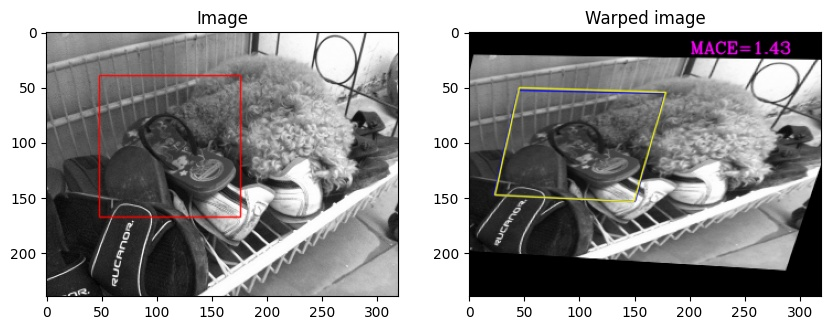
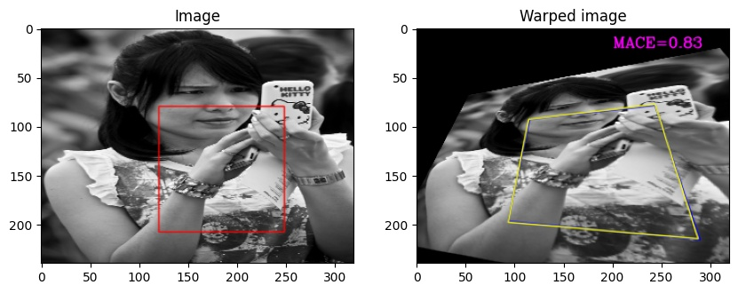
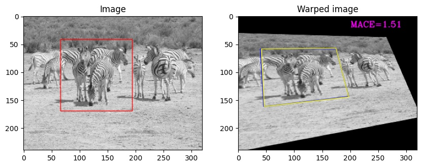
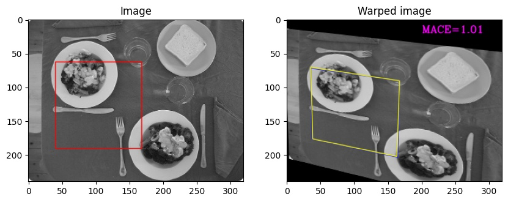
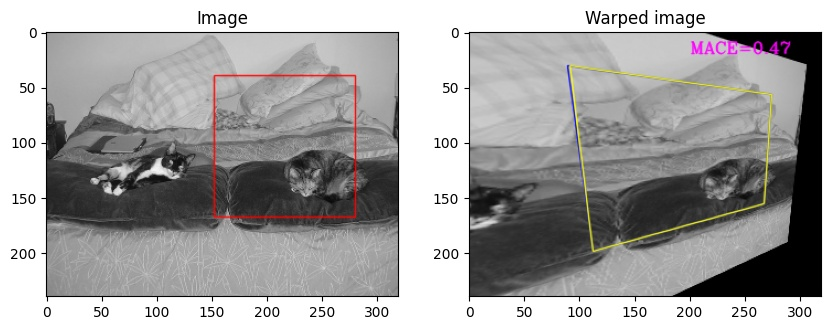

# PFNet-pytorch
PyTorch implementation for reproducing Perspective Network (PFNet) results in the paper [Rethinking Planar Homography Estimation Using Perspective Fields](https://eprints.qut.edu.au/126933/) by Rui Zeng, Simon Denman, Sridha Sridharan, Clinton Fookes.
***
### COCO Dataset
- Download the COCO 2014 dataset used in the paper.
***
### Trained Weights.
- Download our trained weights from [Baidu Cloud](https://pan.baidu.com/s/1nVo55NGG-iCXy__e08SokQ)(Extraction code: enkv) and put it in the root directory

***
### Dependencies
- Python 3.6
- Pytorch 1.8.0

***
### Training
- Train a PFNet model on the COCO dataset from scratch:
  -  `python train.py --dataset=/path/to/COCO`

***
### Evaluation
- Evaluate the model checkpoint
  - `python evaluate.py --dataset=/path/to/COCO --model=./pfnet_0200.pth`

#### Current Performance
```
MACE: 1.21
```

results | 
---   | 
 | 
 | 
 | 
 | 
 | 

##  Reference
[https://github.com/ruizengalways/PFNet](https://github.com/ruizengalways/PFNet)
